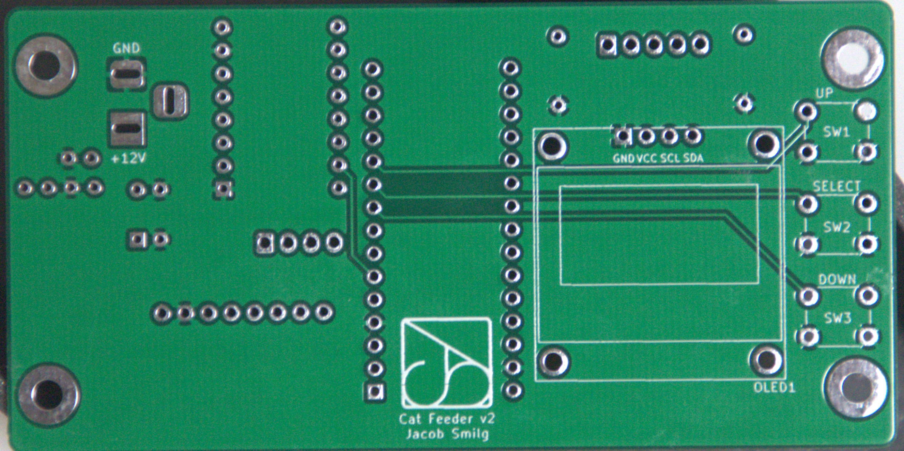

# Kitty Caddy - Automatic Cat Feeder
## Jacob Smilg, Real World Microcontrollers FA '21 (ENGR3499B)

(gif/video of my finished cat feeder)

This project was built for a class I took at Olin in the Fall 2021 semester called Real World Microcontrollers. It's an automatic cat feeder with three rotating food trays that automatically rotates to the next one at a set time each day. The body and mechanism were provided, and I had to design and program the controller PCB.

## Constraints

The requirements were to design and program a controller board for an automatic cat feeder with the following constraints:
- The PCB's size and mounting must adhere to an already designed case/body provided for the class
- Must use the stepper motor, optical sensor, display, and buttons included with the case
- $140 budget for the semester to purchase parts and PCBs

<figure>
<figcaption>The provided case for the project:</figcaption>

</figure>

## Electronics

<figure>
<figcaption>The front and back of my final assembled PCB:</figcaption>

</figure>

### Modules

For this project, students are supposed to use individual modules for their components. Based on the required functionality, I knew I'd need each of the following:
- I2C capable microcontroller with a decent amount of memory to act as the brain and drive the display
- Reliable RTC module
- Stepper motor driver
- Buck converter

I decided to use an Arduino Nano Every, as they are inexpensive, decently powerful, and have plenty of memory for an application like this. For the other things, I tried to balance cost and functionality. I ended up choosing Adafruit's DS3231 RTC module, a knockoff of Polulu's DRV8825 module, and a cheap noname buck converter that can supply up to 3 amps, which is plenty. The Arduino can actually accept 12V on its Vin pin, but my professor wanted me to gain the experience of speccing out the buck converter, so I didn't end up taking advantage of that.

<figure>
<figcaption>My final schematic:</figcaption>

</figure>

### PCB

<figure>
<figcaption>The front and back of my first PCB before assembly:</figcaption>

</figure>

<figure>
<figcaption>The front and back of my final PCB before assembly:</figcaption>

</figure>

<figure>
<figcaption>My final PCB layout:</figcaption>

</figure>

Students are expected to create two revisions of their PCB for this project, so they can fix any mistakes from the first one. My first board ended up working just fine, but I still ordered a second version to tweak the silkscreen and pick a different solder mask color, since I didn't really like the white one. I also had the Vin and 5V out pins on the Arduino connected on the first revision, which I fixed in the second revision. This probably wouldn't have broken anything (I cut through the trace before testing the first revision just in case) since I was supplying 5V on Vin anyways, but better safe than sorry. 

## Software

The software was probably the most involved part of this project for me. I used u8g2 as the base of my UI, and programmed entirely custom menus for setting the time. I used the input handling built into u8g2, but if I had more time I would've liked to implement my own to make the button inputs "autorepeat" when held down. Getting the homing function that aligns the trays on power up fine-tuned was a bit tricky, but it works well. I also drew a splash screen to show while waiting for the homing function to finish, which I think is a nice touch.
